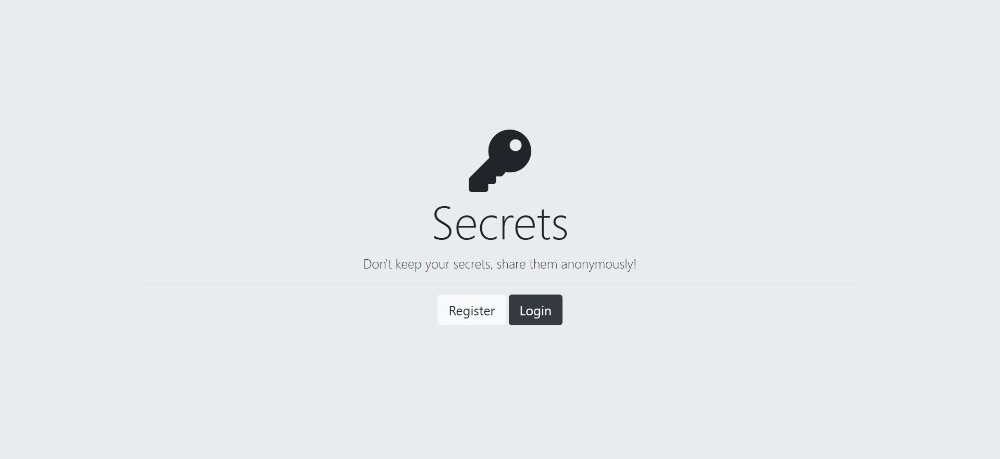
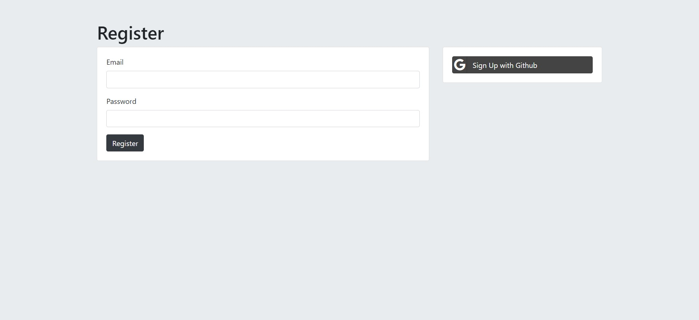

# Node.js Authentication and Security with Passport and MongoDB

This repository contains a Node.js project that demonstrates authentication and security practices using Passport.js for authentication and MongoDB for data storage. It covers topics like OAuth authentication and password hashing for a secure user management system.

## Features

- User registration and login system.
- OAuth authentication with various providers (GitHub).
- Password hashing and secure storage in MongoDB.
- Integration with Passport.js for streamlined authentication.
- Security best practices for preventing common vulnerabilities.

## Getting Started

1. Clone the repository: `git clone https://github.com/aj12-houdini/auth-security-nodejs.git`
2. Navigate to the project directory: `cd Authentication`
3. Install dependencies: `npm install`
4. Configure your MongoDB connection and OAuth credentials
5. Start the application: `npm start`

## Configuration

1. Create a `.env` file in the project root and add the following configuration:
2. MONGODB_URI=mongodb://localhost:27017/auth-security
3. SECRET=Thisisoursecret.
4. SALT_ROUNDS= Any number
5. GITHUB_CLIENT_ID=Enter client id
6. GITHUB_CLIENT_SECRET=Enter client secret

## Usage

1. Open the app in your web browser.
2. Register a new user account or log in using OAuth providers.
3. Explore the authentication and authorization features.
4. Observe the secure storage and retrieval of user data in MongoDB.

## Technologies Used

- Node.js: Building the server and application logic.
- Express.js: Handling routes and middleware.
- Passport.js: Implementing authentication strategies.
- MongoDB: Storing user data securely.
- Bcrypt: Hashing and securing user passwords.
- OAuth: Enabling secure third-party authentication.
- EJS/CSS: Designing the user interface.

## Screenshots

## Contributing

Contributions are welcome! If you have ideas for improvements or find any issues, please [open an issue](https://github.com/aj12-houdini/auth-security-nodejs/issues) or submit a pull request.